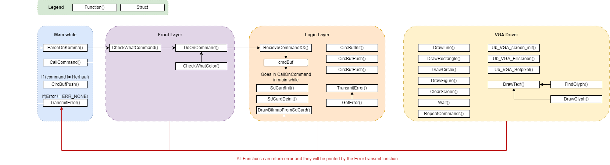

# Driver for user IO to VGA output for STM32F407

This repository contains an example project which utilizes a custom driver which interfaces between a UART peripheral and a VGA-screen driver, allowing for increased simplicity in reusing recycled VGA-screens.

On behalf of IP (Innovative Power) Culemborg, created at the Univeristy of Applied Sciences Utrecht.

## Overview

### Front Layer

The Front Layer is the point of contact between the program and the user. This is where the most errors can occure. The first point of entry is an interupt that takes care of the UART. The recieved messaged is put into an input struct with the command length. When a message is recieved the message is put into the parser to check what command it is. If a command is found the rest of the arguments wil be looked for and added to a new command struct. This command struct is filled with the command number, command arguments, text, font & font style. this struct can be passed on to all the different layers.

### Logic Layer

The logic layer connects the front layer and the IO layer. It consist of a circulair buffer with all commands. When the buffer is read the logic layer will call the functions of the IO layer. This part also contains the errorhandling code. This will catch any errors and will print them via the front layer to the UART. The SD-card is initialized and read in this layer. 

### IO Layer

The IO layer consists of the VGA driver. It has all the functions to draw various shapes on the vga screen. It can also write text in two different fonts(arial and consolas). The bitmaps from the SD card is also drawn on screen here. 

## Use

- lijn, x, y, x’, y’, kleur, dikte
- rechthoek, x_lup, y_lup, breedte, hoogte, kleur, gevuld (1,0) [als 1: rand (1px) met kleur]
- tekst, x, y, kleur, tekst, fontnaam (arial, consolas), fontgrootte (1,2), fontstijl (normaal, vet, cursief)
- bitmap, nr, x-lup, y-lup  [tenminste: pijl (in 4 richtingen), smiley (boos, blij)]
- clearscherm, kleur
- wacht, msecs
- herhaal, aantal (laatst uitgevoerde commando’s), hoevaak (herhalen)
- cirkel, x, y, radius, kleur
- figuur, x1,y1, x2,y2, x3,y3, x4,y4, x5,y5, kleur
Ask the authors for the user manual if you want to use the application

## Built With

* [STM32CubeIDE](https://www.st.com/en/development-tools/stm32cubeide.html) - IDE 
* [STM32F4DISCOVERY](https://www.st.com/en/evaluation-tools/stm32f4discovery.html) - Development Board
* [Google C++ Styleguide](https://google.github.io/styleguide/cppguide.html#Constant_Names) - Styleguide

## Authors

* **Niels van der Zijden** - [Yopocho](https://github.com/yopocho)
* **Ruben Middelman** - [rubenmiddelman](https://github.com/rubenmiddelman) 
* **Sjoerd den Breejen** - [Sjoerddbb](https://github.com/Sjoerddbb) 

## License

This project is licensed under the MIT License

## List of commands
- clearscherm,
- lijn,
- rechthoek,
- wacht,
- tekst,
- bitmap,
- cirkel,
- figuur,
- herhaal,

## known bugs and errors
- [x] command , 
        - (example: clearscherm ,) if there is a space on any other spot there is no problem but when it is a comma richt after the space it will give an unkown command error. This is because it doesnt recoginze the command with a space at the end.
- [x] herhaal, doesnt seem to work
- [x] too many functions don't return an error
- [x] wacht doesn't wait
- [x] negative values in thickness
- [x] too many arguments
- [x] too little arguments is no error
- [ ] extra arguments: (example clearscherm, wit, wit) wordt gewoon uitgevoerd
- [ ] commands without arguments but with, get pushed to VGA
- [x] herhaal, text gets mushed

## posible new features
- [ ] parser filter on \n: so we can send multiple commands at the same 
- [ ] history command that shows the named commands and arguments but doesn't run them
- [ ] random numbers, to auto generate input

